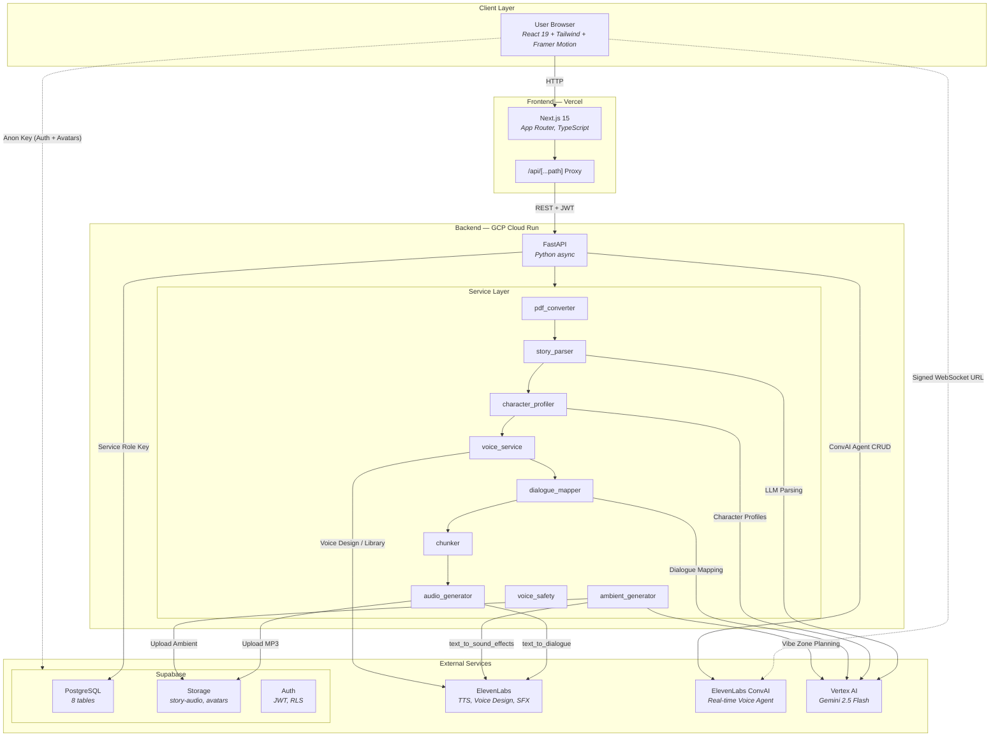
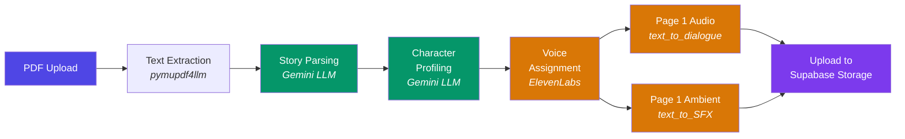
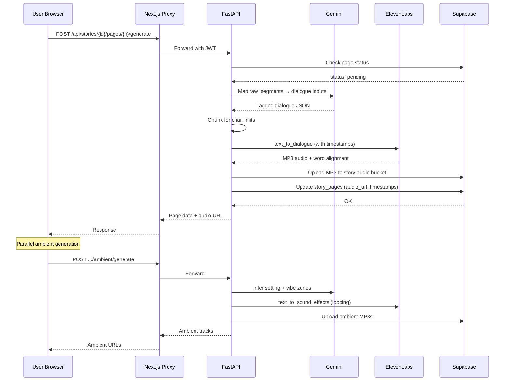
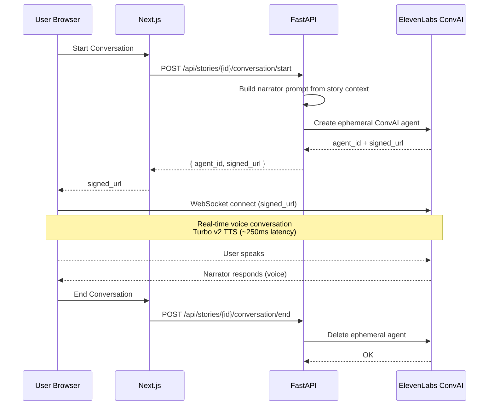
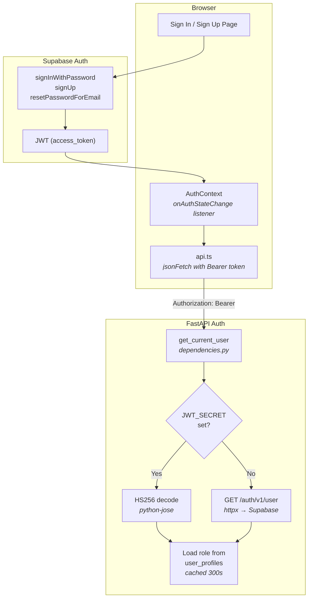
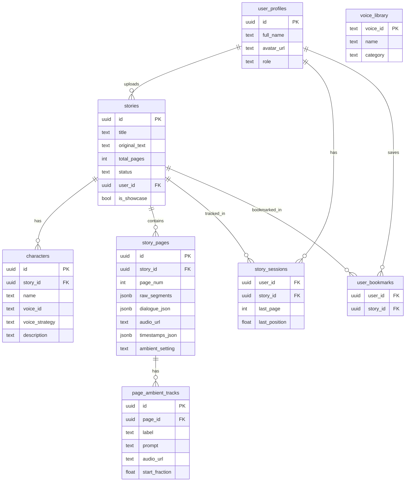
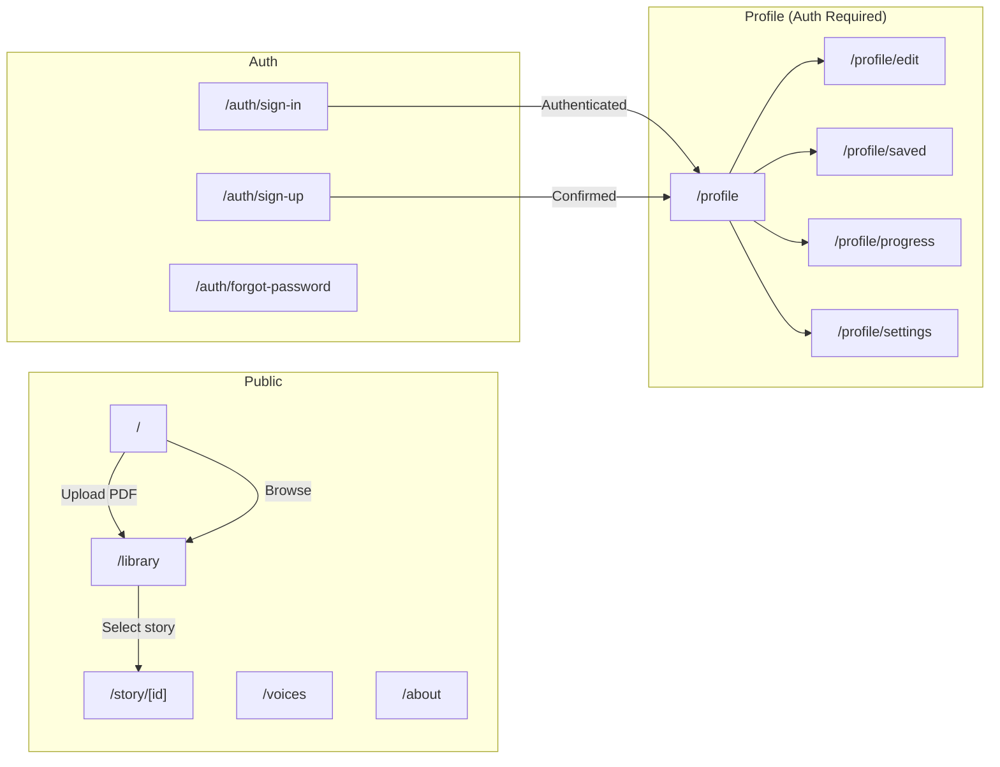

# VoiceTale — Architecture Diagrams

## High-Level System Architecture

## Story Processing Pipeline

## Lazy Page Generation (On Demand)

## Voice Agent Conversation Flow

## Authentication Flow

## Database Schema (Supabase PostgreSQL)

## Frontend Route Map

